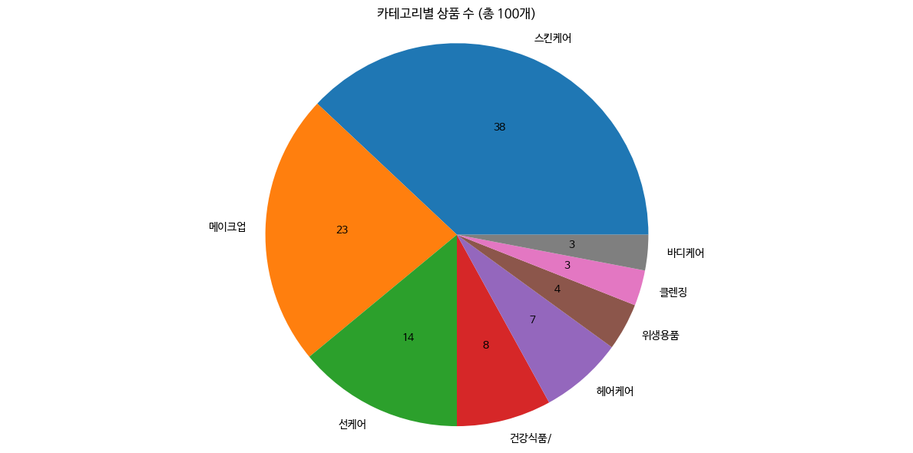
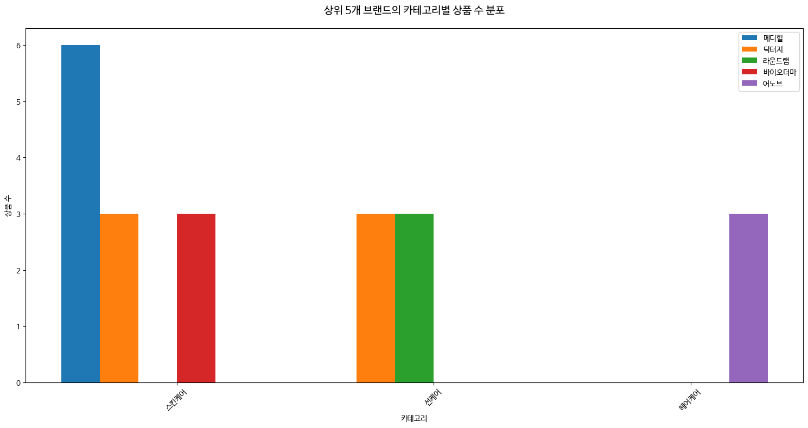
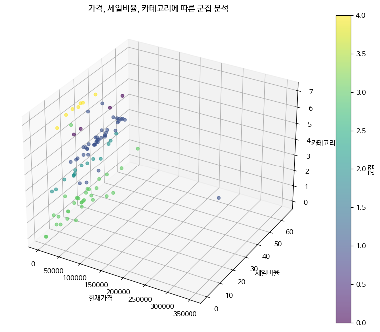

# textanalysis_oliveyoung
This page is to analysis texts about the 'oliveyoung' brand's sales introduction.
LLM 기반 자연어 분류를 활용하여, 
올리브영 제품 상세 안내 문구로부터 제품의 카테고리를 자동 분류하고 브랜드 표현의 제품군별 차이를 분석한 프로젝트 수행

# 올리브영 브랜드 이미지 분석 프로젝트 
올리브영 제품 상세페이지에 사용된 상품 안내 문구를 자연어 처리 기반으로 분석하여,
브랜드의 감성적 이미지가 어떻게 표현되는지를 정량적으로 파악하는 것이 주 목표입니다.

올리브영 상품 판매 페이지의 안내 문구 텍스트를 입력으로 사용해,
LLM 기반 분류기를 통해 제품 카테고리(예: 스킨케어, 클렌징, 건강식품 등) 를 예측함으로써,
브랜드 커뮤니케이션이 제품 유형별로 어떻게 다른지를 분석하고자 함.

* 데이터 출처: 올리브영 공식 온라인몰의 제품 판매 페이지 안내 문구

1. 안내 문구의 특징 분류
2. 카테고리별 주요 키워드 추출
3. 브랜드가 일관되게 사용하는 표현 파악

# 사용 기술
Python (pandas, matplotlib, seaborn, sklearn, re)
Colab 기반 데이터 분석
Scikit-learn KMeans, StandardScaler 활용
Regex 기반 한글 키워드 추출

올리브영 상품 데이터 분석 프로젝트

프로젝트 개요
본 프로젝트는 올리브영 판매 페이지에서 수집한 상품 안내문구 및 메타데이터를 기반으로, 제품의 카테고리 분류, 브랜드 특성 분석, 텍스트 키워드 추출, 군집 분석을 수행하여 올리브영 내 제품 전략과 마케팅 특성을 탐색하는 것을 목적으로 합니다.

주요 분석 내용 및 인사이트

# 1. LLM 기반 안내문구 텍스트 분류
리뷰가 아닌 상품 안내문구만을 이용해 LLM 기반 카테고리 분류를 시도
스킨케어, 메이크업, 선케어 등 실제 제품 분류와 높은 일치율 확보
→ 카테고리 누락/오분류 상품 자동 보정, 검색 정확도 향상에 활용 가능

# 2. 카테고리별 상품 수 및 세일 비율 분석
스킨케어(38%), 메이크업(23%) 카테고리 집중도 매우 높음
세일 비율은 클렌징, 위생용품, 스킨케어가 거의 100% 세일 중
→ 입문용/재고 소진용 세일 가능성, 반면 건강식품/헤어케어는 낮은 세일률로 충성고객 대상일 수 있음

# 3. 브랜드별 집중 카테고리
총 69개 브랜드, 이 중 상위 5개 브랜드 분석:
메디힐: 스킨케어에 집중 (6/6)
어노브: 헤어케어에만 분포
닥터지, 라운드랩, 바이오더마 등도 특정 카테고리에 집중
→ 브랜드 포지셔닝이 제품 라인업에 반영되어 있음

# 4. 텍스트 키워드 분석 (상품명 기준)

스킨케어 제품명: 기획, 세럼, 증정, 크림 등 기능·구성 위주
메이크업 제품명: 단품, 틴트, 쿠션, 컬러 등 포장·색상 중심
→ 마케팅 관점에서 전달 메시지가 뚜렷하게 다름

# 5. KMeans 군집 분석 (가격, 세일율, 카테고리 기반)

총 5개 군집으로 분류하여 군집별 특성 비교

군집 0: 저가 + 고세일, 위생용품 중심
군집 1: 고가 + 중세일, 스킨케어 중심
군집 4: 고가 + 낮은 세일, 헤어케어 중심
→ 소비자 세그먼트에 따른 가격 정책 및 프로모션 전략 설계에 활용 가능

# 결론 및 활용 가능성
## 분석 항목 : 비즈니스 활용 가능성 
안내문구 기반 카테고리 분류 : 검색 정확도 향상, 카테고리 자동 태깅 
브랜드별 카테고리 집중도 : 입점 전략, 브랜드 전용관 구성 기준 
텍스트 키워드 분석 : 마케팅 문구 최적화, 트렌드 파악 
가격·할인율 기반 군집화 : 고객 세그먼트별 가격 전략, 세일 타겟 설정

## 사용 기술
Python (Pandas, Matplotlib, Seaborn, Sklearn, re, collections)
LLM 기반 텍스트 분류 (OpenAI API 기반 수작업 또는 사전 분류 결과 활용)
시각화: matplotlib, 한글 폰트 적용

## 향후 확장 가능성
사용자 리뷰 분석과 연동해 제품 만족도 기반 추천 시스템 구축
시간 흐름에 따른 신제품 트렌드 변화 추이 분석
할인율/정가 기준 가격 민감도 분석
웹 기반 대시보드로 시각화 및 인사이트 배포 (e.g. Streamlit)

## Code
👉 [코드 바로 보기](./oliveyoung.ipynb)
